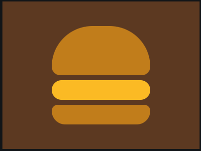
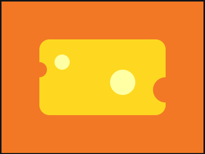

# CSS_draws

These were the CSS_Battle exercises made in February. Click over the image if you want to check the code (test the code in the [CSS_Battle](https://cssbattle.dev/) environment).

**Notes:** Check the exercises in CSS_Battle (✔️), but also looks great directly from `html` file (✅)

### February, 1st ✔️ ✅

### February, 2nd ✔️ ✅

### February, 3rd ✔️ ✅

### February, 4th ✔️ ✅

