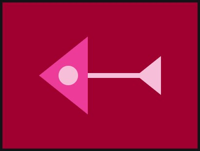
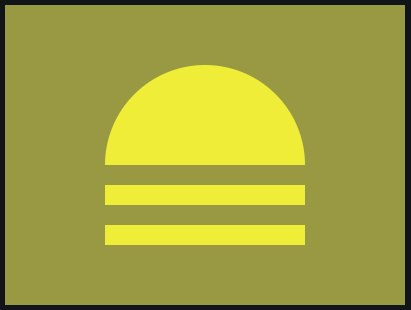
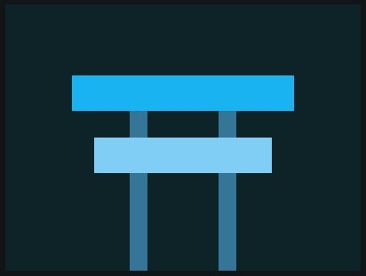
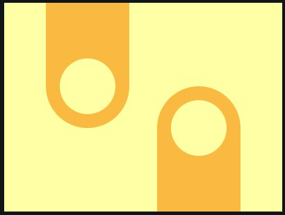
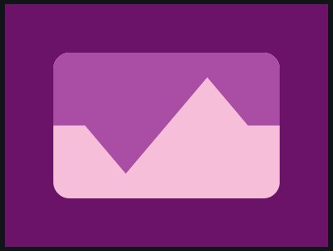
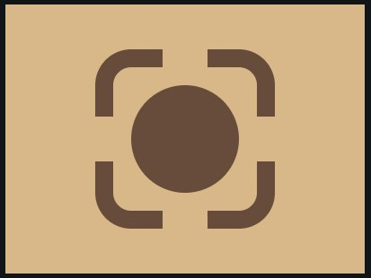
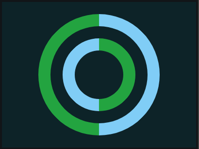

# CSS_draws

These were the CSS_Battle exercises made in January. Click over the image if you want to check the code (test the code in the [CSS_Battle](https://cssbattle.dev/) environment).

**Notes:** Check the exercises in CSS_Battle (✔️), but also looks great directly from `html` file (✅)

### January, 23th ✔️ ✅

### January, 24th ✔️ ✅

### January, 25th ✔️ ✅

### January, 26th ✔️

### January, 27th ✔️ ✅

### January, 28th ✔️ ✅

### January, 29th ✔️ ✅

### January, 30th ✔️ ✅

### January, 31th ✔️ ✅

